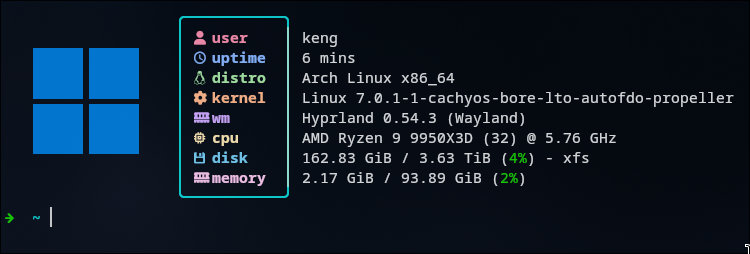

# Create Config

- `docker compose run --rm kernel-config`

# Compile Kernel

- `docker compose run --rm kernel-builder`

# Prepare Installation

- update `/etc/mkinitcpio.d/linux-bore-lto-afdo-propeller.preset` add `default_options="-S autodetect"`

# Installation

- `sudo pacman -U --overwrite '*' ./out/linux-bore-lto-afdo-propeller*.pkg.tar.zst`
