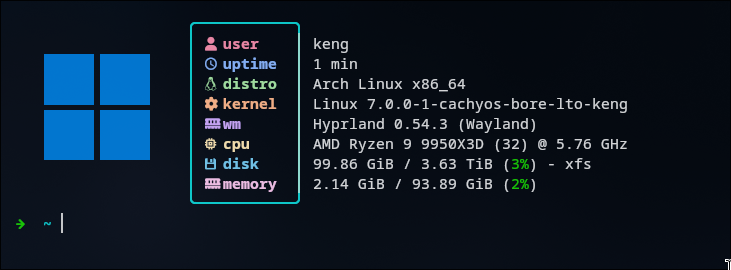

# Create Config

- `docker compose run --rm kernel-config`

# Compile Kernel

- `docker compose run --rm kernel-builder`

# Prepare Installation

- update `/etc/mkinitcpio.d/linux-cachyos-bore-lto.preset` add `default_options="-S autodetect"`

# Installation

- `sudo pacman -U --overwrite '*' ~/dotfiles/utils/kernel/out/linux-cachyos-bore-lto*.pkg.tar.zst`