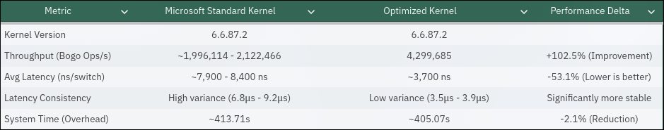

> [!CAUTION]
> **WARNING: EXPERIMENTAL BUILD**
>
> This project is for development and testing purposes only. The resulting builds are considered unstable and may cause issues.

# Create Config(Optional)

- `docker compose run --rm kernel-config`

# Compile Kernel

- `docker compose run --rm kernel-builder`

# Installation

- remove your old custom modules `sudo rm -rf /usr/lib/modules/*-lto-keng-WSL2`

- `sudo cp -r ./out/modules/lib/modules/* /usr/lib/modules/`

### Windows Host

- Update `C:\Users\<user>\.wslconfig` Added
```
[wsl2]
...
kernel=C:\\Users\\<user>\\kernel\\vmlinux
...
```

- Download vmlinux to
`C:\Users\<user>\kernel\vmlinux`

# After Reboot WSL2

`sudo depmod -a $(uname -r)`

# One-Time Systemd Setup
- Ensure systemd is enabled in `/etc/wsl.conf`:
```
[boot]
systemd=true
```

- Create `/etc/modules-load.d/docker-net.conf` and append:
```
iptable_filter
iptable_nat
ipt_MASQUERADE
br_netfilter
xt_addrtype
xt_conntrack
ip6table_filter
ip6table_nat
iptable_raw
ip6table_raw
```

# Context Switch Benchmark

